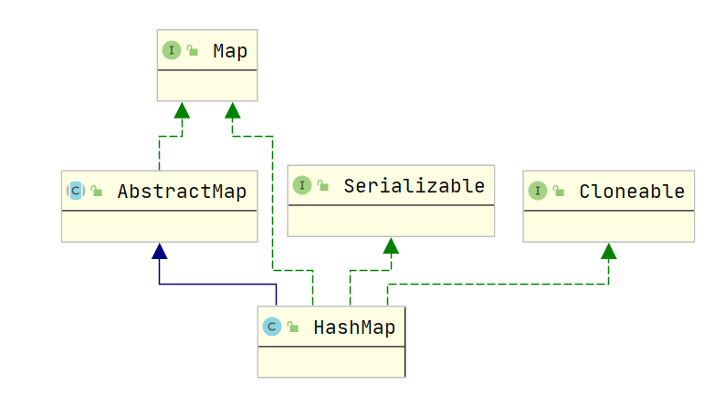

HashMap源码分析

HashMap简介

HashMap是基于哈希表的Map接口的实现；允许键值为null;HashMap和HashTable相似，只是HashMap线程不安全，不同步，且允许null值。不保证元素的顺序。

假设hash函数将元素恰当的放置在存储桶内(buckets),HashMap对于get和put操作提供了恒定的时间性能。迭代需要的时间和HashMap的capacity(也就是桶的数量)以及大小(key-value的映射数量)成比例；因此，如果考虑迭代性能的话，不要将初始化容量设置过高（或者设置过小的负载因子）；

HashMap有两个影响其性能的参数：初始化容量以及负载因子；capacity是哈希表中的存储桶的数量，而初始化容量就是创建hashTable时的容量；负载因子是在容量自动增加之前允许哈希表得到满足的度量；当哈希表中元素的数量超过负载系数和当前容量的乘积时，哈希表被重新整理（即，内部数据结构被重建），因此哈希表的存储桶数量约为存储桶数量的两倍。

通常，负载因子为0.75在时间和空间成本上提供了一个很好的折中；较高的值会减少空间开销，但会增加查找成本，设置其初始容量时，应考虑映射中的预期数量及其负载因子，以最大程度地减少重新哈希操作的数量；如果初始容量大于最大条目数除以负载系数，则不会进行任何哈希操作。

如果要在HashMap实例中存储许多映射，则创建具有足够大容量的映射将比使映射能够根据表的增长自动进行散列更有效地存储映射；注意，使用许多具有相同 hashCode（）的键是降低任何哈希表性能的肯定方法。为了改善影响，当键是Comparable时，此类可以使用键之间的比较顺序来帮助打破平局。

hashMap不是线程安全的；如果多个线程同时访问一个哈希映射，并且线程中的至少一个在结构上修改（增加活删除元素）了该映射，则它必须在外部进行同步。修改一个已经存在的键中的值不是结构上的修改；使用synchronizedMap可以防止这样的情况发生“Map m = Collections.synchronizedMap(new HashMap(...));”；

所有此类的“集合视图方法” 返回的迭代器都是快速失败（fail-fast）:如果在创建迭代器之后的任何时候都对结构进行了结构修改，则除了通过迭代器自己的 remove方法之外，该迭代器将以任何其他方式抛出 ConcurrentModificationException。因此，面对并发的修改，迭代器会迅速而干净地失败，而不是冒着在不确定的将来冒着任意，不确定的行为的风险。

注意，不能保证迭代器的快速失败行为，因为通常来说，在存在不同步的并发修改的情况下，不可能做出任何严格的保证。快速迭代器尽最大努力抛出ConcurrentModificationException，因此，编写依赖于此异常的程序的正确性是错误的：迭代器的快速故障行为仅应用于检测错误。

该映射通常用作装箱【binned】（存储桶）的哈希表,但是当bin太大时，它们会转换为TreeNode的bin，每个结构与java.util.TreeMap中的类似;大多数方法尝试使用普通的bin，但是在适用时中继到TreeNode方法（只需检查节点的instance即可）。TreeNodes的bin可以像其他任何遍历一样使用，但过度填充时还支持更快的查找；但是，由于正常使用中的绝大多数bins并未过载，因此在过程中可能会延迟bins的存在检查。

红黑树bins（即其元素均为TreeNode的箱）主要由hashCode排序，但是在平局的情况下，如果两个元素属于同一“ class C implements Comparable<C>”类型，则使用它们的compareTo方法进行排序（我们通过反射保守地检查泛型类型以验证）。当键具有不同的哈希值或可排序时，红黑树的bins增加的复杂性提供最坏的O（log n）操作，因此，在hashCode（）方法的偶然或恶意使用情况下，性能会优雅降低。返回分布不佳的值，以及许多键共享一个hashCode的值，只要它们也是可比较的。如果上述两种方法都不适用，那么与不采取任何预防措施相比，我们可能浪费约两倍的时间和空间,但是唯一已知的情况是由于不良的已经很缓慢的用户编程实践，以至于几乎没有什么区别。

因为TreeNode的大小约为常规节点的两倍，仅在bins包含足以保证使用的节点时才使用它们;当它们变得太小（由于移除或调整大小）时，它们会转换回普通bin；在具有良好分布的用户hashCode的用法中，很少使用红黑树的bins。

通常，红黑树的bins的根是其第一个节点,有时（当前仅在Iterator.remove上），根可能在其他位置，但是可以在父链接之后恢复（方法TreeNode.root（））;所有适用的内部方法都将哈希码作为参数（通常由公共方法提供），从而允许它们彼此调用而无需重新计算用户hashCodes,大多数内部方法还接受一个“ tab”参数，通常是当前表，但是在调整大小或转换时可以是新表或旧表。

当bin列表被树化，拆分或未树化时，我们将它们保持在相同的相对访问/遍历顺序（即，字段 Node.next）中，以更好地保留局部性，并稍微简化了对调用的拆分和遍历的处理iterator.remove。

HashMap继承实现关系

HashMap常量

~~~java
// 默认的初始化容量大小,为16；一定是2的幂次
int DEFAULT_INITIAL_CAPACITY = 1 << 4;
// 最大的容量；2^30
int MAXIMUM_CAPACITY = 1 << 30;
// 在构造函数中未指定时使用的负载系数
float DEFAULT_LOAD_FACTOR = 0.75f;
// 使用树而不是bin的列表的bin计数阈值，将元素添加到至少具有这么多节点的bin中时，bin会转换为树，它的值必须大于2，并且至少应为8，以与移除树时的假设相吻合，该移除涉及因收缩而转换回普通bin;
int TREEIFY_THRESHOLD = 8;
// 用于在调整大小操作期间取消树化（拆分）bin的bin计数阈值
int UNTREEIFY_THRESHOLD = 6;
// 可将树形化的最小table容量,至少应为4 * TREEIFY_THRESHOLD以避免大小调整和树化阈值之间的冲突
int MIN_TREEIFY_CAPACITY = 64;
~~~

Node属性（链表的元素）

~~~java
final int hash;
final K key;
V value;
Node<K,V> next;
~~~

静态方法

~~~java
// 计算key.hashCode（）并将散列的较高位扩展（XOR）到较低位;
// (h = key.hashCode()) ^ (h >>> 16) 是为了让hashCode的高16位参与hash的运算，散列更均匀；而采用^ 运算，不用&或|，则是避免结果偏向0或者1，导致不均匀。
static final int hash(Object key);
// 对于给定的目标容量，返回两倍大小的幂;期间用到了numberOfLeadingZeros方法(返回无符号整型i的最高非零位前面的0的个数):典型的二分法应用，在jdk8和12中两者的具体实现有一些差别，具体在n的改动上，8中n从1开始，12中n从31开始
/**
*public static int numberOfLeadingZeros(int i) {
        //
        if (i == 0)    
            return 32;
        int n = 1;  
        if (i >>> 16 == 0) { n += 16; i <<= 16; }
        if (i >>> 24 == 0) { n +=  8; i <<=  8; }
        if (i >>> 28 == 0) { n +=  4; i <<=  4; }
        if (i >>> 30 == 0) { n +=  2; i <<=  2; }
        n -= i >>> 31;
        return n;
    }
*/
// 加入给定的容量为15，返回16，如果是是30，返回32
static final int tableSizeFor(int cap){
    int n = -1 >>> Integer.numberOfLeadingZeros(cap - 1);
    return (n < 0) ? 1 : (n >= MAXIMUM_CAPACITY) ? MAXIMUM_CAPACITY : n + 1;
};
~~~

构造方法 

~~~java
// 指定初始化容量和负载因子
public HashMap(int initialCapacity, float loadFactor);
// 指定初始化容量，默认负载因子
public HashMap(int initialCapacity);
// 默认初始化容量，默认负载因子
public HashMap();
// 使用默认负载因子和已有的map新建一个map，调用了putMapEntries，在下面会说到
public HashMap(Map<? extends K, ? extends V> m); 
~~~

常见方法

~~~java
// 获取元素数量
public int size();
// 判断map是否为空
public boolean isEmpty();
// 判断map是否包含指定的键,调用了getNode方法
public boolean containsKey(Object key);
~~~

get(Object key)

过程描述：

1.首先查看【(n-1)&hash】的位置元素是否符合需要的key-value条件，如果符合，则返回对应的节点；因为在散列的时候也会这样散列；

2.如果不符合，则说明当前节点的值在散列的时候发生了hash碰撞，可能会用到链表，也可能会用到红黑，所以接下来的操作分两个分支进行查找：

3.如果是链表的话，则遍历链表查找对应的key,直到获取到value值；

4.如果节点属于红黑树节点的话，则在红黑树下找。

~~~java
// 如果没有这个键对应的值，则返回null;同样的映射最多有一个；containsKey可以区分map中没有元素与元素为null的情况；
public V get(Object key) {
        Node<K,V> e;
        return (e = getNode(hash(key), key)) == null ? null : e.value;
}
final Node<K,V> getNode(int hash, Object key) {
        Node<K,V>[] tab; Node<K,V> first, e; int n; K k;
        if ((tab = table) != null && (n = tab.length) > 0 &&
            (first = tab[(n - 1) & hash]) != null) {
            // 查看是否是(n - 1) & hash位置元素,如果是的话，则返回元素节点
            if (first.hash == hash && // always check first node
                ((k = first.key) == key || (key != null && key.equals(k))))
                return first;
            // 当前不止一个节点
            if ((e = first.next) != null) {
                // 当前节点为红黑树节点，在红黑树下找
                if (first instanceof TreeNode)
                    return ((TreeNode<K,V>)first).getTreeNode(hash, key);
                // 否则在链表中查找
                do {
                    if (e.hash == hash &&
                        ((k = e.key) == key || (key != null && key.equals(k))))
                        return e;
                } while ((e = e.next) != null);
            }
        }
        return null;
}
~~~

put(K key, V value)、

过程描述：

1.判断table是否为null以及初始化长度是否为0，如果未初始化则调用resize()扩容；

2.如果tab[i]=null，则直接插入对应的新元素；

3.如果当前的key存在，则直接覆盖原值；如果key不存在，且当前的table[i]节点为TreeNode,则按照红黑树的插入方式插入；否则的话，遍历链表，如果key存在，则覆盖，如果不存在，则判断是否满足树化的条件，满足则树化；

4.// 判断容量大小，是否需要进行扩容，需要则扩容。

注意：HashMap的put会返回key的上一次保存的数据。

~~~java
public V put(K key, V value) {
    return putVal(hash(key), key, value, false, true);
}
// onlyIfAbsent:如果为true,则不更新现有的值
// evict 如果为false，则表处于创建模式
final V putVal(int hash, K key, V value, boolean onlyIfAbsent,
                   boolean evict) {
        Node<K,V>[] tab;
        Node<K,V> p;
        int n, i;
    	// 判断table是否为null以及初始化长度是否为0，如果未初始化则调用resize()扩容
        if ((tab = table) == null || (n = tab.length) == 0)
            n = (tab = resize()).length;
    	// 如果tab[i]=null，说明要插入的索引位置上没有元素，则直接插入
        if ((p = tab[i = (n - 1) & hash]) == null)
            tab[i] = newNode(hash, key, value, null);
        else {
            Node<K,V> e; K k;
            // 如果当前的key存在，则直接覆盖原值
            if (p.hash == hash &&
                ((k = p.key) == key || (key != null && key.equals(k))))
                e = p;
            // 如果key不存在，且当前的table[i]节点为TreeNode,则按照红黑树的插入方式插入
            else if (p instanceof TreeNode)
                e = ((TreeNode<K,V>)p).putTreeVal(this, tab, hash, key, value);
            else {
                // 遍历链表，如果key存在，则覆盖，如果不存在，则判断是否满足树化的条件，满足则树化；
                for (int binCount = 0; ; ++binCount) {
                    if ((e = p.next) == null) {
                        p.next = newNode(hash, key, value, null);
                        if (binCount >= TREEIFY_THRESHOLD - 1) // -1 for 1st
                            treeifyBin(tab, hash);
                        break;
                    }
                    if (e.hash == hash &&
                        ((k = e.key) == key || (key != null && key.equals(k))))
                        break;
                    p = e;
                }
            }
            if (e != null) { // existing mapping for key
                V oldValue = e.value;
                if (!onlyIfAbsent || oldValue == null)
                    e.value = value;
                afterNodeAccess(e);
                return oldValue;
            }
        }
    	// 判断容量大小，是否需要进行扩容，需要则扩容
        ++modCount;
        if (++size > threshold)
            resize();
        afterNodeInsertion(evict);
        return null;
    }
~~~

resize()

过程描述：

1.查看当前表的容量是否已经超过最大容量，如果是的话，则赋值为最大容量，否则判断当前表容量是否已经超过初始化容量16，如果超过，则将阈值扩大到原来的两倍；

2.如果当前表容量为0，当前阈值大于0，则将新的容量赋值为当前阈值；

3.如果以上条件均不满足，则新容量和阈值均为默认值；

4.按照新的容量生成数组，按照新容量的大小按模取余获取元素下标，如果节点是红黑树的类型，那么添加到红黑树中，否则将原来的元素放置在原位置或者原偏移2倍的位置。

~~~java
final Node<K,V>[] resize() {
        Node<K,V>[] oldTab = table;
        int oldCap = (oldTab == null) ? 0 : oldTab.length;
        int oldThr = threshold;
        int newCap, newThr = 0;
        if (oldCap > 0) {
            if (oldCap >= MAXIMUM_CAPACITY) {
                threshold = Integer.MAX_VALUE;
                return oldTab;
            }
            else if ((newCap = oldCap << 1) < MAXIMUM_CAPACITY &&
                     oldCap >= DEFAULT_INITIAL_CAPACITY)
                // 如果扩大一倍之后小于最大容量并且原来的容量已经超过了初始化容量16
                newThr = oldThr << 1; // double threshold
        }
        else if (oldThr > 0) // initial capacity was placed in threshold
            // 旧容量 =0，旧阈值>0,则使用旧阈值作为新的容量值
            newCap = oldThr;
        else {               // zero initial threshold signifies using defaults
            // 零初始阈值表示使用默认值
            newCap = DEFAULT_INITIAL_CAPACITY;
            newThr = (int)(DEFAULT_LOAD_FACTOR * DEFAULT_INITIAL_CAPACITY);
        }
        if (newThr == 0) {
            float ft = (float)newCap * loadFactor;
            newThr = (newCap < MAXIMUM_CAPACITY && ft < (float)MAXIMUM_CAPACITY ?
                      (int)ft : Integer.MAX_VALUE);
        }
        threshold = newThr;
        @SuppressWarnings({"rawtypes","unchecked"})
        // 按照新的容量生成数组
        Node<K,V>[] newTab = (Node<K,V>[])new Node[newCap];
        table = newTab;
        if (oldTab != null) {
            for (int j = 0; j < oldCap; ++j) {
                Node<K,V> e;
                if ((e = oldTab[j]) != null) {
                    oldTab[j] = null;
                    if (e.next == null)
                        // 按照新容量的大小按模取余获取下标；
                        newTab[e.hash & (newCap - 1)] = e;
                    else if (e instanceof TreeNode)
                        // 如果e是红黑树的类型，那么添加到红黑树中
                        ((TreeNode<K,V>)e).split(this, newTab, j, oldCap);
                    else { // preserve order
                        Node<K,V> loHead = null, loTail = null;
                        Node<K,V> hiHead = null, hiTail = null;
                        Node<K,V> next;
                        do {
                            next = e.next;
                            if ((e.hash & oldCap) == 0) {
                                if (loTail == null)
                                    loHead = e;
                                else
                                    loTail.next = e;
                                loTail = e;
                            }
                            else {
                                if (hiTail == null)
                                    hiHead = e;
                                else
                                    hiTail.next = e;
                                hiTail = e;
                            }
                        } while ((e = next) != null);
                        if (loTail != null) {
                            loTail.next = null;
                            newTab[j] = loHead;
                        }
                        if (hiTail != null) {
                            hiTail.next = null;
                            newTab[j + oldCap] = hiHead;
                        }
                    }
                }
            }
        }
        return newTab;
    }
~~~

